## Overview

This project is intended to simulate Differential Growth in Blender, using ScriptNodeLite node of Sverchok add-on.

## Description

This project offers scripts to make Differential Growth animation in Blender with ScriptNodeLite node of Sverchok add-on. These scripts can be used in Sverchok node editor, so you can create various types of simulation with other nodes.

## Usage

To use these codes,  
- Install Blender.  
- Install Sverchok add-on.  
- Open Sverchok node Editor.  
- Click '+New' button to open new node editor data block.  
- Add 'ScriptNodeLite' node in the block.
- Open Text Editor in another Area.  
- Click '+New' button to open new text data block.  
- Copy and paste one of the scripts in the text block.  
- Put the text block name to the text box in 'ScriptNodeLite' node and click the right button in the node.  
- Connect input datas from other nodes and use output data with other ones.  
- To get more better results, edit the parameters in the script.

### Parameters
#### differential_line_growth.py
Input Datas:
- steps: Total frame steps.
- verts_in: Vertices of the source circle.
- edges_in: Edges of the source circle.
- seed: Random seed to make first velocities.
- framenum: Frame number of output datas.
- verts_boundary: Vertices of the boundary (optional).  

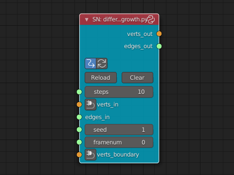

The verts_in and edges_in should be in a cyclic order, and as small as possible.
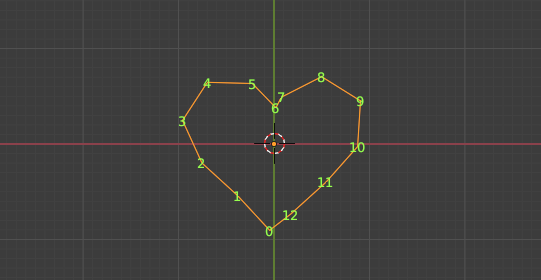

More detailed parameters in the script:
- COHESION_FORCE/DISTANCE/ANGLE: Cohesion parameters between each vertices.  
- SEPARATION_FORCE/DISTANCE/ANGLE: Separation parameters between each vertices. 
- BOUNDARY_FORCE/DISTANCE/ANGLE:  Boundary parameters between each vertices. 
- MIN/MAX_VELOCITY:  Velocity of the vertices.
- MAX_LINE_LENGTH:  Max distance between each vertices.

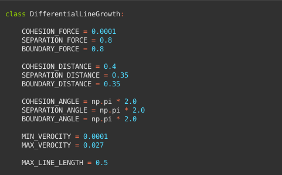

#### differential_growth_on_mesh.py
Input Datas:
- verts_in:  Mesh vertices.
- faces_in:  Mesh polygons
- selected_verts_in: Vertices of the source circle on the mesh.  
- selected_edges_in: Edges of the source circle on the mesh.  
- steps: Total frame steps.
- seed: Random seed to make first velocities.
- framenum: Frame number of output datas.

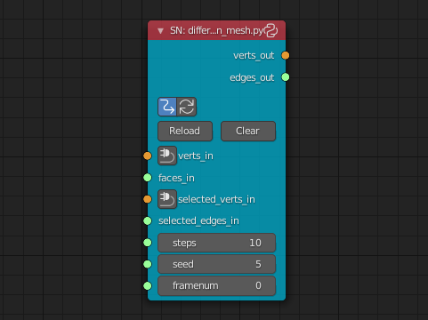

The selected_verts_in and selected_edges_in should be in a cyclic order, and as small as possible.
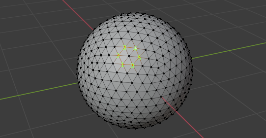

More detailed parameters in the script:
- COHESION_FORCE/DISTANCE: Cohesion parameters between each vertices.  
- SEPARATION_FORCE/DISTANCE: Separation parameters between each vertices. 
- MIN/MAX_VELOCITY:  Velocity of the vertices.
- MAX_LINE_LENGTH:  Max distance between each vertices.

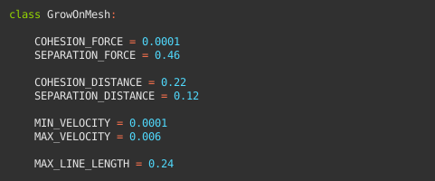

#### differential_mesh_growth.py
Input Datas:
- steps: Total frame steps.
- vertices_in:  Mesh vertices
- edges_in:  Mesh edges
- faces_in:  Mesh polygons
- weights_in: Vertex weights
- random_seed: Random seed to make first velocities
- relax_iterations: Iteration count to relax mesh
- max_edge_length: Max distance between each vertices
- framenum: Frame number of output datas

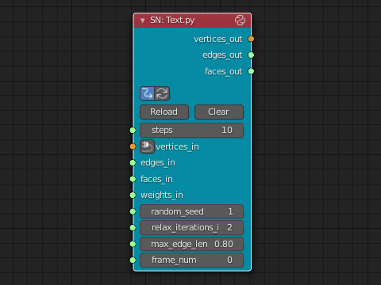

More detailed parameters in the script:  
- SEPARATION_FORCE/DISTANCE: Separation parameters between each vertices. Ratio to the average edge length.  
- MAX_VELOCITY:  Max velocity of the vertices. If edges become larger than this value, the edges will be subdivided.  
- COHESION_FORCE/DISTANCE: Cohesion parameters between each vertices.  
- RELAX_WEIGHTED_ONLY: Apply relax mesh only for vertices whose weight values are larger than zero.

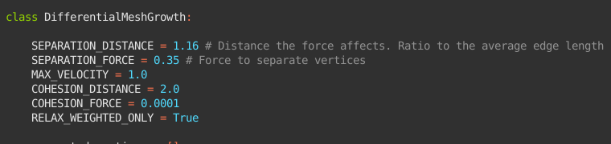

## Examples

### Differential Line Growth
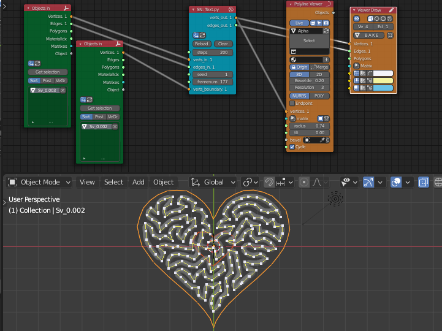

### Differential Growth on mesh
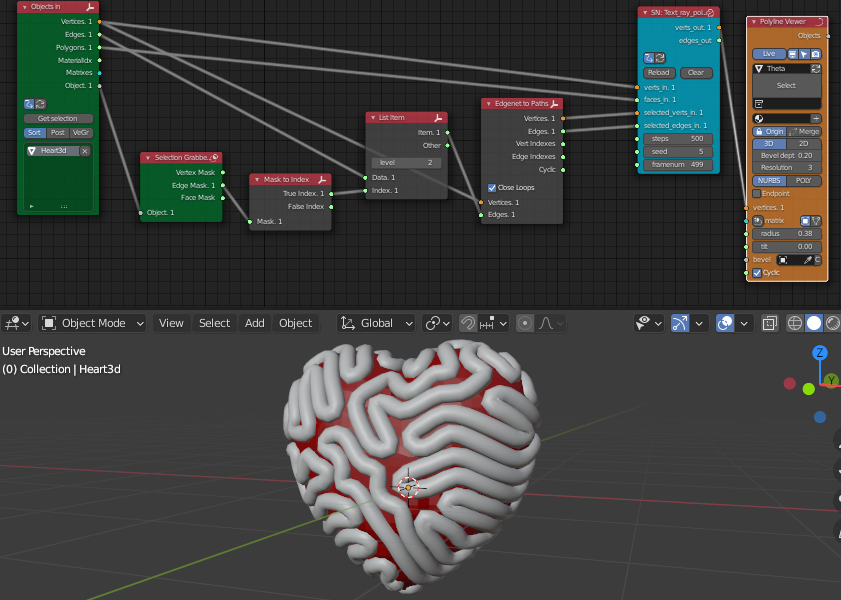

### Differential Mesh Growth

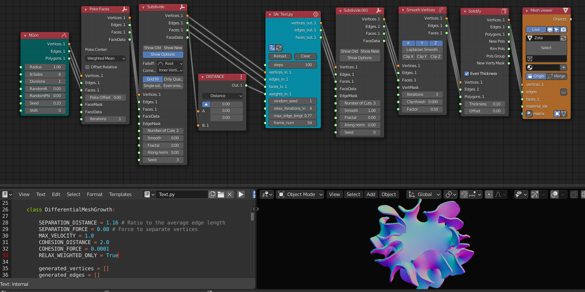

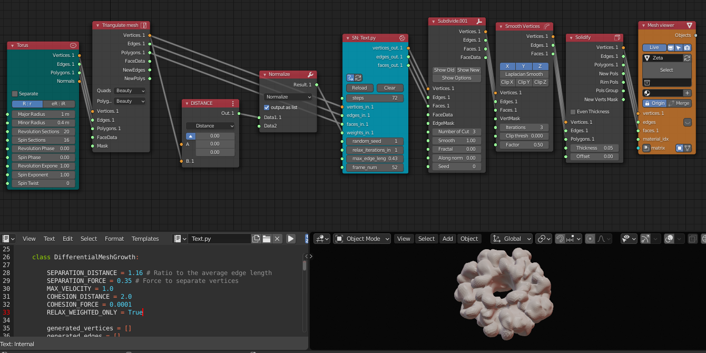

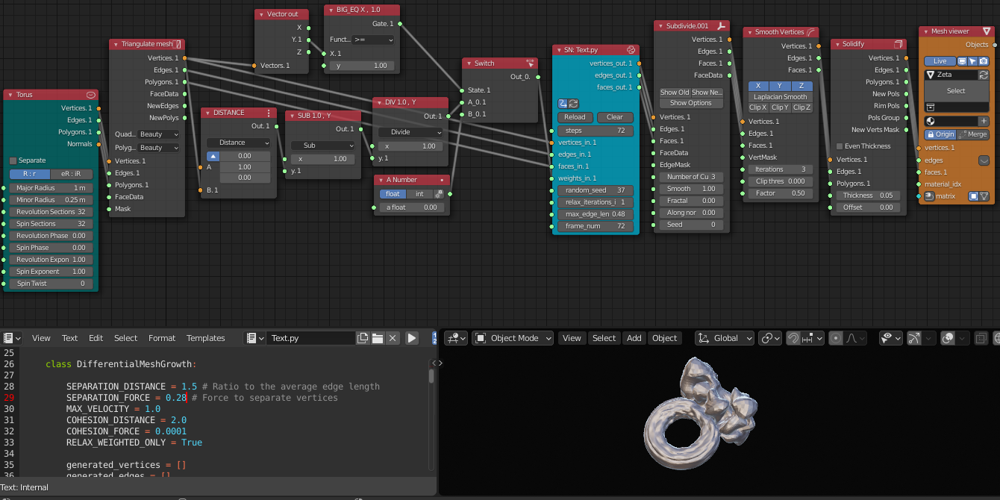

## Author

asahidari

## LICENSE

[GPL 3](https://www.gnu.org/licenses/quick-guide-gplv3.html)
